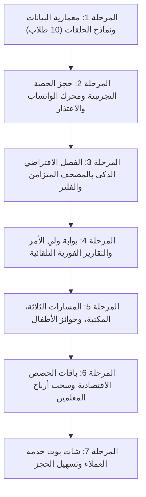

# 📜 وثيقة خطة الأكاديمية الشاملة — أكاديمية الأثر الطيب
> **الهدف الأسمى:** أن نكون المنصة رقم 1 عالمياً في تعليم وتحفيظ القرآن الكريم والعلوم الشرعية.
> **تاريخ الاعتماد:** 17 سبتمبر 2026 | **الإصدار:** Master Plan V7.0

---

## 📌 الفهرس العام
1. [المحور الأول: الرؤية، الجمهور المستهدف، واللغات](#1-المحور-الأول-الرؤية-الجمهور-المستهدف-واللغات)
2. [المحور الثاني: نموذج العمل، التسعير، والمالية](#2-المحور-الثاني-نموذج-العمل-التسعير-والمالية)
3. [المحور الثالث: الرحلة التعليمية، الفصول، ولوحة ولي الأمر](#3-المحور-الثالث-الرحلة-التعليمية-الفصول-ولوحة-ولي-الأمر)
4. [المحور الرابع: تقنيات القرآن والذكاء الاصطناعي](#4-المحور-الرابع-تقنيات-القرآن-والذكاء-الاصطناعي)
5. [المحور الخامس: المسارات التعليمية، الشهادات، ونظام التحفيز](#5-المحور-الخامس-المسارات-التعليمية-الشهادات-ونظام-التحفيز)
6. [المحور السادس: التواصل، التنبيهات، وسياسة الحضور والغياب](#6-المحور-السادس-التواصل-التنبيهات-وسياسة-الحضور-والغياب)
7. [المحور السابع: الأمان، الخصوصية، ولوحة تحكم الإدارة](#7-المحور-السابع-الأمان-الخصوصية-ولوحة-تحكم-الإدارة)
8. [جدول المراحل التنفيذية (Engineering Roadmap V7)](#8-جدول-المراحل-التنفيذية-engineering-roadmap-v7)

---

## 1. المحور الأول: الرؤية، الجمهور المستهدف، واللغات

### ❓ الأسئلة المطروحة:
* **س1:** ما هي الرؤية الكبرى للمنصة ومن هي الشريحة رقم 1 ذات الأولوية القصوى حالياً؟
* **س2:** هل المنصة موجهة للأفراد (B2C) أم للمؤسسات والمدارس (B2B)؟
* **س3:** ما هي اللغات الأساسية المعتمدة في المرحلة الحالية؟

### ✅ القرارات المعتمدة:
1. **الرؤية والهدف:** المنصة مؤهلة لتكون المنصة رقم 1 عالمياً لتحفيظ القرآن الكريم.
2. **الجمهور المستهدف حالياً:** التركيز الكامل في المرحلة الأولى على **مصر والعالم العربي والخليج** (مصر، السعودية، الإمارات، الكويت، المغرب، الجزائر، وباقي الدول العربية).
3. **نموذج الاستهداف:** حالياً موجهة بنسبة 100% **للأفراد والعائلات (B2C)** والوصول إليهم عبر الحملات التسويقية والإعلانات، مع قابلية البنية للتوسع مستقبلاً لخدمة المدارس والمراكز (B2B).
4. **اللغات:** التركيز المطلق على **اللغتين العربية والإنجليزية** حالياً لضمان أعلى جودة وإتقان في الواجهات وتجربة المستخدم.

---

## 2. المحور الثاني: نموذج العمل، التسعير، والمالية

### ❓ الأسئلة المطروحة:
* **س1:** كيف يدفع الطلاب وما هي خيارات الباقات؟
* **س2:** ما هي استراتيجية التسعير وكيف تتحدد أجور المعلمين ونسبة الأكاديمية؟
* **س3:** ما هي بوابات الدفع المستهدفة للطلاب وكيف يسحب المعلمون أرباحهم؟

### ✅ القرارات المعتمدة:
1. **طريقة الدفع والباقات:**
   - إتاحة جميع وسائل الدفع المناسبة لكل دولة (وسائل عالمية مثل PayPal وبطاقات بنكية، ومحلية).
   - توفير خيارين مرنين: **الدفع بالحصة الواحدة** أو **الدفع بالاشتراك الشهري**.
   - توفير **حصة تجريبية مجانية (Free Trial)** لكل طالب جديد لجذب المشتركين عبر الإعلانات.
2. **استراتيجية التسعير الثورية (الحلقات الاقتصادية - 10 طلاب):**
   - لتشجيع أكبر عدد من الطلاب على الانضمام، تم اعتماد نظام الحلقات الجماعية (10 طلاب من نفس المستوى):
     - **داخل مصر:** تبدأ الحصة من **20 جنيهاً مصرياً** فقط للطالب.
     - **خارج مصر:** تبدأ الحصة من **1 دولار** فقط للطالب.
3. **أجور المعلمين ونسبة الأكاديمية:**
   - أجر المعلم يُحسب بالساعة (مثلاً 50 إلى 100 جنيه في مصر، أو ما يعادلها)، أو بنظام نسبة مئوية مرنة (مثل 70% للأكاديمية و30% للمعلم أو العكس حسب نوع الحصة والباقة).
   - سحب أرباح المعلمين يتم بسهولة عبر **InstaPay** ومحافظ فودافون كاش في مصر والتحويلات البنكية.

---

## 3. المحور الثالث: الرحلة التعليمية، الفصول، ولوحة ولي الأمر

### ❓ الأسئلة المطروحة:
* **س1:** كيف يتم توزيع وتسكين الطلاب في الحلقات الجماعية؟
* **س2:** ما هي أدوات التفاعل الأساسية داخل الفصل الافتراضي المباشر؟
* **س3:** كيف يتابع ولي الأمر تقدم أبنائه ويتواصل مع المعلم؟

### ✅ القرارات المعتمدة:
1. **تسكين الطلاب (Placement Engine):**
   - يبدأ الطالب بالحصة التجريبية، وفيها يقيس المعلم مستواه بدقة.
   - يتم تجميع الطلاب المتطابقين في المستوى والسن داخل حلقة واحدة (حتى 10 طلاب).
   - **فصل تام بين الجنسين:** حلقات الذكور مع معلمين شيوخ، وحلقات الإناث مع معلمات مجازات.
2. **أدوات الفصل الافتراضي (Live Virtual Classroom):**
   - تجهيز الغرف الافتراضية بأحدث الأدوات التفاعلية العالمية التي تخدم مصلحة الطالب (مصحف رقمي متزامن بين المعلم والطلاب، تنظيم الدور ورفع اليد، كتم وتشغيل المايكات، والسبورة التعليمية).
3. **متابعة ولي الأمر:**
   - تقرير الحصة يُرسل تلقائياً لولي الأمر فور انتهاء كل حصة عبر **الواتساب أو التيليجرام**.
   - توفير **بوابة خاصة لولي الأمر (Guardian Portal)** داخل الموقع لمتابعة تقارير جميع أولاده والتواصل المباشر مع الشيخ.

---

## 4. المحور الرابع: تقنيات القرآن والذكاء الاصطناعي

### ❓ الأسئلة المطروحة:
* **س1:** ما هو الدور المحدد للذكاء الاصطناعي حالياً؟ هل يشمل التسميع الآلي الصوتي؟
* **س2:** هل نوفر شات بوت ذكي أو اختبارات توليدية بالذكاء الاصطناعي؟

### ✅ القرارات المعتمدة (منهج هندسي واقعي ومقتصد):
1. **تأجيل التسميع الصوتي الآلي (Speech AI):** لتقليل التكاليف الباهظة في البداية، مع الاعتماد على **مساعدين للشيخ (كادر بشري)** للتسميع والمتابعة الفردية، وهو أعلى موثوقية وجودة شرعية.
2. **الاستفادة من الذكاء الاصطناعي الخفيف عالي التأثير:**
   - توليد وصياغة تقارير الطلاب التلقائية لترسل إلى أولياء الأمور.
   - تشغيل **شات بوت ذكي لخدمة العملاء والكول سنتر** للرد الفوري على استفسارات الزوار وتسهيل الحجز.
3. **المستقبل:** تأجيل الاختبارات التوليدية بالذكاء الاصطناعي لمرحلة لاحقة لتفادي النفقات العالية حالياً.

---

## 5. المحور الخامس: المسارات التعليمية، الشهادات، ونظام التحفيز

### ❓ الأسئلة المطروحة:
* **س1:** ما هي المسارات التعليمية الرسمية المعتمدة في الأكاديمية؟
* **س2:** ما هي آلية الشهادات والمسابقات؟
* **س3:** كيف نحفز الأطفال والناشئة؟

### ✅ القرارات المعتمدة:
1. **المسارات التعليمية الثلاثة:**
   - **المسار الأول:** مسار التحفيظ والمراجعة (حفظ تراكمي ومراجعة صغرى وكبرى لجميع الأجزاء).
   - **المسار الثاني:** مسار الإجازة والتلقين وشرح أحكام التجويد والمتون (متن تحفة الأطفال، الجزرية، الشاطبية، وأسانيد متصلة).
   - **المسار الثالث:** مسار تأسيس الأطفال (القراءة والتهجي والقاعدة النورانية ونور البيان).
   - **المكتبة الرقمية:** توفير مكتبة رقمية لتحميل كتب ومناهج وملازم هذه المسارات مجاناً بصيغة PDF.
2. **الشهادات والمسابقات:**
   - إصدار شهادة إتمام مرحلة رسمية لكل طالب يجتاز مستوى بنجاح.
   - تنظيم **مسابقات قرآنية وجوائز دورية كل 6 أشهر**.
3. **نظام تحفيز مخصص للأطفال:**
   - سيستم متكامل ومخصص للأطفال بهدايا، جوائز، ونقاط وأوسمة تشجيعية لربطهم بالقرآن.

---

## 6. المحور السادس: التواصل، التنبيهات، وسياسة الحضور والغياب

### ❓ الأسئلة المطروحة:
* **س1:** ما هي خطة التذكير والتنبيه قبل الحصص؟
* **س2:** ما هي سياسة الاعتذار والتعويض عند غياب الطالب؟

### ✅ القرارات المعتمدة:
1. **منظومة التذكير عبر الواتساب (Multi-Stage Reminders):**
   - **تذكير أول:** قبل الحصة بـ **يوم كامل (24 ساعة)** برابط ورسالة واتساب للطالب وولي الأمر.
   - **تذكير ثانٍ:** قبل الحصة بـ **نصف ساعة (30 دقيقة)** للتأكيد ورابط الدخول المباشر.
   - **في حالة الغياب:** يتم فوراً إخطار ولي الأمر عبر الواتساب بغياب الطالب للاطمئنان عليه ومتابعة السبب.
2. **سياسة الاعتذار والتعويض:**
   - الاعتذار مسموح به قبل الحصة بـ **6 ساعات**.
   - يتم الاعتذار بضغطة زر تفاعلية من رسالة الواتساب `[متواجد / غير متواجد]`، وتسمع الإجابة فوراً داخل جدول المنصة.
   - إذا تم الاعتذار في الوقت المحدد، تسعى الأكاديمية لتوفير **حصة تعويضية** للطالب.

---

## 7. المحور السابع: الأمان، الخصوصية، ولوحة تحكم الإدارة

### ❓ الأسئلة المطروحة:
* **س1:** ما هي ضوابط الأمان والخصوصية في الشات والغرف؟
* **س2:** هل يحق لولي الأمر والمشرف مراقبة الحصة؟
* **س3:** ما هي متطلبات لوحة تحكم الإدارة اليومية؟

### ✅ القرارات المعتمدة:
1. **فلتر الأمان الصارم في الشات:**
   - **منع تبادل أرقام الهواتف أو الروابط الخارجية** تماماً داخل شات الحصص لحماية خصوصية الطلاب والمعلمات والأسر.
2. **حق المراقبة والإشراف (Observer Mode):**
   - يحق لولي الأمر أو المشرف الأكاديمي الدخول في أي وقت إلى الغرفة الافتراضية لمتابعة سير الحصة والاطمئنان على جودة التدريس.
3. **لوحة تحكم الإدارة (Admin Dashboard):**
   - متابعة الحصص المجدولة يومياً لحظة بلحظة.
   - رصد تقارير الحضور والغياب والاعتذارات.
   - متابعة إجمالي الأرباح والمبالغ المستحقة للمعلمين واعتماد تحويلها.
   - معالجة طلبات الحصص التجريبية الجديدة وتسكين الطلاب.

---

## 8. جدول المراحل التنفيذية (Engineering Roadmap V7)

| المرحلة | العنوان الهندسي | المخرجات البرمجية | الحالة |
|---|---|---|---|
| **V7.1** | **معمارية البيانات والربط العائلي** | نموذج `GroupCircle`، نموذج `TrialRequest`، تحديث `User` لدعم ربط ولي الأمر، وتحديث `Session`. | ✅ مكتمل ومختبر |
| **V7.2** | **محرك الحجز ورسائل الواتساب** | حجز التجربة، تنبيهات 24س و 30د، ونظام الاعتذار قبل 6س عبر الواتساب. | ✅ مكتمل ومختبر |
| **V7.3** | **الفصل الافتراضي التفاعلي** | المصحف المتزامن، المايكات والدور، وضع مراقبة ولي الأمر، وفلتر حظر الأرقام. | ✅ مكتمل ومختبر |
| **V7.4** | **بوابة ولي الأمر والتقارير** | إرسال بطاقة التقرير للواتساب، ولوحة متابعة كل الأبناء وحصص التعويض. | ✅ مكتمل ومختبر |
| **V7.5** | **المسارات وجوائز الأطفال** | المسارات الثلاثة، مكتبة الـ PDF، ونظام مسابقات كل 6 أشهر والجوائز. | ✅ مكتمل ومختبر |
| **V7.6** | **المحرك المالي وأجور المعلمين** | تسعير الـ 20 ج والـ 1$، وحساب مستحقات المعلمين مع InstaPay. | ✅ مكتمل ومختبر |
| **V7.7** | **شات بوت خدمة العملاء** | بوت الموقع للمبيعات والدعم الفني وحجز التجربة عبر الواتساب. | ✅ مكتمل ومختبر |

---
**تم التوثيق والاعتماد — فريق التطوير الهندسي لأكاديمية الأثر الطيب**
